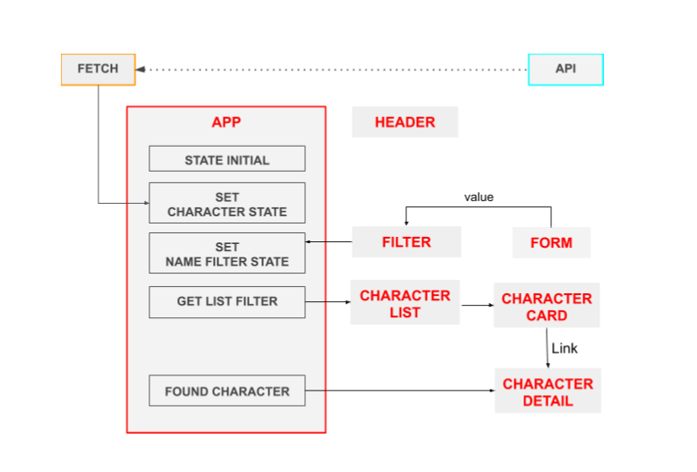

# Módulo-3-evaluación-final-rosannablanco

Desarrollo de una página web con React.js que muestra un listado de personajes de la serie Rick and Morty con un campo de búsqueda por nombre del personaje.

## Requisitos

Necesitas tener instalado [Node.js](https://nodejs.org/).

## Iniciar proyecto

1. Descarga o clona el repositorio
2. Instala las dependencias locales con `npm install`
3. Arranca el repo en local con `npm start`
4. Se ejecuta la página en [http://localhost:3000/#/](http://localhost:3000/#/)

## Diagrama de flujo

## Cómo funciona

1. Al cargar la página se muestra un listado de 20 personajes.
2. En el campo de texto se puede buscar por el nombre del personaje.
3. Al introducir un nombre se muestra un listado de personajes que coincide con el texto introducido.
4. Podemos acceder al detalle del personaje con más información haciendo click sobre el personaje.
5. Dentro de detalle podemos regresar al listado desde "Volver".

## Casos

### Búsqueda por nombre

Si el nombre introducido no coincide con ningún personaje, la página mostrará un mensaje de "No hay resultados con la palabra xxx".

### Acceder directamente al detalle del personaje

1. Accede directamente al detalle del personaje desde la ruta : http://localhost:3000/#/detail/id

2. El listado contiene 20 personajes, navega directamente al detalle añadiendo como id un número del 1 al 20.
   http://localhost:3000/#/detail/15

3. Introduce un id que no existe, la página muestra un mensaje: "El personaje que buscas no existe".
